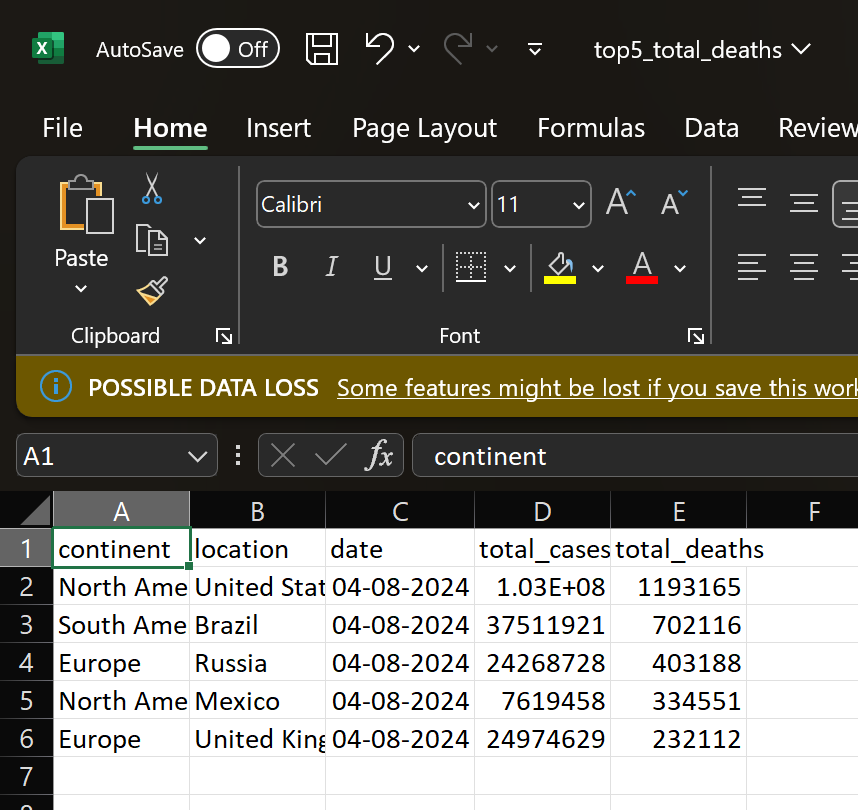

# COVID DATA PIPELINE

This mini Data Engineering project demonstrates a complete ETL workflow using **Python**, **Apache Airflow**, and **Docker**. It showcases data ingestion from public COVID-19 datasets, transformation into insights, and orchestration through a DAG pipeline.

---

## Features

### 1) Extract
- Pull data from [disease.sh](https://disease.sh) COVID API  
- Download CSV data from [Our World in Data](https://ourworldindata.org)

### 2) Transform
- Clean and filter datasets using **Pandas** and **NumPy**
- Generate insights (e.g., top 5 countries by total deaths)

### 3) Load
- Output transformed data to local `.csv` files or logs
- Orchestrated and scheduled using **Apache Airflow**

---

## Technologies Used
- Python  
- NumPy  
- Pandas  
- Seaborn  
- Matplotlib  
- Docker  
- Apache Airflow  

---

## Folder Structure


  docker/ – Airflow setup, logs, and plugins
  
  dags/ - DAG python files
  
  data/ – Raw input CSV files
  
  scripts/ – Python ETL scripts
  
  notebook/ - Jupyter notebooks for analysis of the dataset
  
  visuals/ - Visualizing the insights and saving it's images
  
  .gitattribute - Git LFS configuration for large files
  
  .gitignore – Files to ignore in Git
  
  README.md – This file


> ⚠️ Note: CSV files are versioned using **Git LFS**, as configured in `.gitattributes`.

---

##  How to Run 

To run the Airflow pipeline locally using Docker:
1) Navigate to the docker/ directory
    ```cd docker```
2) Start the Docker containers 
    ``` docker-compose up -d ```
3) Wait for all Airflow services to initialize. This may take a minute.
4) Access the Airflow web UI :
Open http://localhost:8080/dags/ in your browser.
5) Trigger the DAG manually
Find covid_data_pipeline in the list and click the ▶️ Trigger DAG button.

---
<h3>Sample Output</h3>

<p>Below is a sample output showing the top 5 countries by total COVID-19 deaths.</p>



---

Let me know if you want to add:
- **Run instructions**  
- **DAG overview diagram**  
- **Sample output preview**  

You can now commit this version of `README.md`:

```bash
git add README.md
git commit -m "Improve README formatting and add folder structure"
git push
